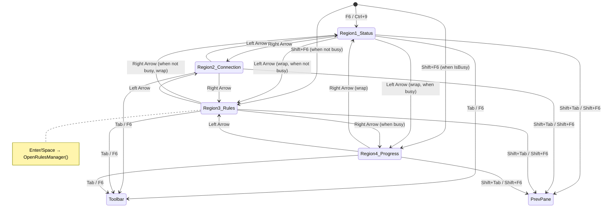
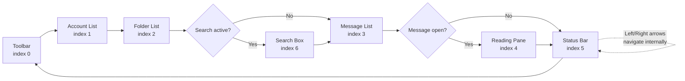
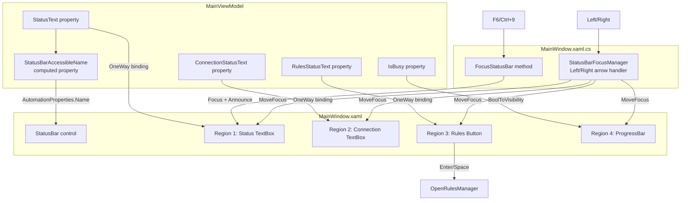

# Status Bar Accessibility — Development Specification

**Status:** Draft  
**Version:** 1.0  
**Date:** 2026-05-24  
**Target:** AI coding agent implementation  
**References:** VS Code status bar, Microsoft Office status bar, UIA StatusBar control pattern

---

## Table of Contents

1. [Overview & Goals](#1-overview--goals)
2. [Current State Analysis](#2-current-state-analysis)
3. [Target Architecture](#3-target-architecture)
4. [State & Focus Diagrams](#4-state--focus-diagrams)
5. [Code Flow](#5-code-flow)
6. [Files to Modify](#6-files-to-modify)
7. [Implementation Order](#7-implementation-order)
8. [Detailed Specifications](#8-detailed-specifications)
   - [8.1 `MainWindow.xaml` — Status Bar XAML](#81-mainwindowxaml--status-bar-xaml)
   - [8.2 `MainWindow.xaml.cs` — Keyboard & Focus Logic](#82-mainwindowxamlcs--keyboard--focus-logic)
   - [8.3 `MainViewModel.cs` — New Properties](#83-mainviewmodelcs--new-properties)
   - [8.4 `AccessibleStyles.xaml` — New Styles](#84-accessiblestylesxaml--new-styles)
9. [Accessibility Checklist](#9-accessibility-checklist)
10. [Test Plan](#10-test-plan)
11. [Build Verification](#11-build-verification)
12. [Appendix A: Screen Reader Status Bar Commands](#appendix-a-screen-reader-status-bar-commands)
13. [Appendix B: UIA Control Patterns Reference](#appendix-b-uia-control-patterns-reference)

---

## 1. Overview & Goals

The status bar is the least accessible part of QuickMail. While it is technically in the F6 pane cycle, it has only one functional focus stop — the `StatusTextBox`. The Rules region and ProgressBar are invisible to keyboard navigation. Screen readers cannot explore the status bar region-by-region, and the standard screen-reader commands for reading a status bar (JAWS `Insert+PageDown`, NVDA `Insert+End`, Narrator `CapsLock+PageDown`) produce poor results because the UIA `StatusBar` control pattern is not fully leveraged.

### Goals (modeled on VS Code & Microsoft Office)

1. **F6 loop integration.** The status bar is already in the F6 cycle (pane index 5). This stays.
2. **Left/Right arrow navigation within the status bar.** When focus is inside the status bar, Left/Right arrows move between regions. Tab exits the status bar to the next F6 pane.
3. **Each region is a proper accessible control.** Informational regions use read-only `TextBox` (ControlType.Edit + ValuePattern). Clickable regions use `Button` (ControlType.Button + InvokePattern). Every region has a meaningful `AutomationProperties.Name`.
4. **Screen-reader status-bar commands work.** The `StatusBar` control exposes its UIA `StatusBar` pattern correctly so JAWS, NVDA, and Narrator can read the entire bar with their dedicated status-bar commands.

### Non-goals

- Adding new status bar regions beyond what exists today (Status text, Rules, Progress). The plan improves accessibility of existing regions; new regions can be added later following the same patterns.
- Extracting a separate `StatusBarViewModel`. The status bar properties remain on `MainViewModel` to minimize scope. A future refactor can extract them.
- Changing the visual appearance. The status bar should look identical to today.

---

## 2. Current State Analysis

### 2.1 XAML Structure (MainWindow.xaml lines 1334–1376)

```
StatusBar (x:Name="MainStatusBar")
├── StatusBarItem (x:Name="StatusTextItem")     ← Focusable=False, IsTabStop=False
│   └── TextBox (x:Name="StatusTextBox")        ← IsReadOnly=True, IsTabStop=False, Focusable=True
├── StatusBarItem (x:Name="RulesStatusItem")    ← Focusable=False, IsTabStop=False, HorizontalAlignment=Right
│   └── TextBox                                ← IsReadOnly=True, IsTabStop=False, Focusable=True, Cursor=Hand
└── StatusBarItem (x:Name="StatusProgressItem") ← Focusable=False, IsTabStop=False, Visibility bound to IsBusy
    └── ProgressBar                             ← IsIndeterminate=True
```

### 2.2 What Works

| Feature | Status |
|---------|--------|
| F6 lands on status bar | ✅ `CycleFocusAsync` includes pane index 5 |
| Ctrl+9 jumps to status bar | ✅ `FocusStatusBar` command registered |
| StatusText binding updates | ✅ Two-way binding to `MainViewModel.StatusText` |
| RulesStatusText binding updates | ✅ Two-way binding to `MainViewModel.RulesStatusText` |
| ProgressBar shows during sync | ✅ Visibility bound to `MainViewModel.IsBusy` |
| Screen reader announces on focus | ✅ `FocusStatusBar()` calls `AccessibilityHelper.Announce()` |
| StatusText changes are debounce-announced | ✅ `QueueStatusAnnounce` in code-behind |

### 2.3 What's Broken

| Issue | Severity | Detail |
|-------|----------|--------|
| No left/right navigation within status bar | **High** | Only `StatusTextBox` receives focus. Rules and Progress regions are unreachable via keyboard. |
| Rules region is a TextBox with Cursor=Hand | **Medium** | Screen readers announce it as "edit" or "text", not as an interactive button. Users don't know it's clickable. |
| Rules TextBox has `IsTabStop="False"` | **High** | Even if focus somehow reached it, Tab would skip it. |
| `StatusBarItem` wrappers are `Focusable="False"` | **Medium** | Prevents UIA from treating each region as a distinct element in the status bar tree. |
| No `AutomationProperties.Name` on Rules TextBox child | **Low** | The binding `AutomationProperties.Name="{Binding RulesStatusText}"` is on the `StatusBarItem`, not the `TextBox`. The TextBox has no name. |
| ProgressBar unreachable when visible | **Medium** | When sync is running, a screen reader user cannot navigate to the progress bar to hear "Loading in progress." |
| StatusBar `AutomationProperties.Name` is static "Status bar" | **Low** | Should include key status info so screen-reader status-bar commands read useful content. |
| No `KeyboardNavigation.TabNavigation` set on StatusBar | **Medium** | Default behavior may not confine arrow key navigation properly. |

### 2.4 Current F6 Cycle Code (MainWindow.xaml.cs)

```csharp
// GetFocusedPaneIndex() — lines 1656–1667
// Returns: 0=Toolbar, 1=AccountList, 2=FolderList, 3=MessageList/ConvTree,
//          4=ReadingPane, 5=StatusBar, 6=SearchBox

// FocusPaneAtAsync(5) — line 1688
case 5: FocusStatusBar(); break;

// FocusStatusBar() — lines 1634–1639
private void FocusStatusBar()
{
    StatusTextBox.Focus();
    AccessibilityHelper.Announce(this, $"Status bar: {_vm.StatusText}",
        category: AnnouncementCategory.Result);
}
```

### 2.5 Current Rules Click Handler (MainWindow.xaml.cs)

```csharp
// Lines ~168-176 — wired in constructor
RulesStatusItem.MouseLeftButtonDown += (_, _) => OpenRulesManager();
RulesStatusItem.KeyDown += (_, e) =>
{
    if (e.Key == Key.Enter || e.Key == Key.Space)
    {
        OpenRulesManager();
        e.Handled = true;
    }
};
```

This is fragile: `KeyDown` on a `StatusBarItem` (which is `Focusable="False"`) will never fire because the item never receives keyboard focus. The inner `TextBox` has `IsTabStop="False"` so it won't receive focus either. The handler only works by accident if focus somehow lands there.

---

## 3. Target Architecture

### 3.1 Region Model

The status bar contains **regions**. Each region is a self-contained focus stop with:
- A **control type** appropriate to its function (TextBox for info, Button for actions, ProgressBar for progress)
- An **`AutomationProperties.Name`** that describes what the region shows
- A **position** in the left-to-right tab order within the status bar

| # | Region | Control | VM Property | Interactive | Visibility |
|---|--------|---------|-------------|-------------|------------|
| 1 | Status message | `TextBox` (read-only) | `StatusText` | No | Always |
| 2 | Connection state | `TextBox` (read-only) | `ConnectionStatusText` | No | Always |
| 3 | Rules | `Button` | `RulesStatusText` | Yes → opens Rules Manager | Always |
| 4 | Sync progress | `ProgressBar` | — | No | When `IsBusy` |

### 3.2 Keyboard Contract

```
┌─────────────────────────────────────────────────────────────┐
│  Status Bar — Keyboard Contract                             │
│                                                             │
│  Entering:  F6 (forward) or Shift+F6 (backward) from any    │
│             other pane lands on the first/last region.       │
│             Ctrl+9 jumps directly to region 1.               │
│                                                             │
│  Within:    Left Arrow  → move to previous region (wraps)   │
│             Right Arrow → move to next region (wraps)       │
│             Enter/Space → activate clickable region          │
│                                                             │
│  Exiting:   Tab         → move to Toolbar (next F6 pane)    │
│             Shift+Tab   → move to Reading Pane / Msg List   │
│             F6          → move to Toolbar (next F6 pane)    │
│             Shift+F6    → move to previous F6 pane          │
│             Escape      → return focus to message list       │
└─────────────────────────────────────────────────────────────┘
```

### 3.3 UIA Tree (Target)

```
StatusBar  ControlType.StatusBar  Name="Status bar — Ready"
├── StatusBarItem (region 1)
│   └── TextBox  ControlType.Edit  Name="Status — Ready"
│       ValuePattern.Value = "Ready"
├── StatusBarItem (region 2)
│   └── TextBox  ControlType.Edit  Name="Connection — Connected"
│       ValuePattern.Value = "Connected"
├── StatusBarItem (region 3)
│   └── Button  ControlType.Button  Name="Rules — 3 active, 1 disabled"
│       InvokePattern (opens Rules Manager)
└── StatusBarItem (region 4, visibility collapsed when not busy)
    └── ProgressBar  ControlType.ProgressBar  Name="Syncing mail…"
        RangeValuePattern (indeterminate)
```

### 3.4 New ViewModel Properties

Two new properties on `MainViewModel`:

| Property | Type | Purpose |
|----------|------|---------|
| `ConnectionStatusText` | `string` | "Connected", "Offline", "Connecting…", or account count |
| `StatusBarAccessibleName` | `string` | Computed name for the StatusBar itself, e.g. "Status bar — 12 messages" |

`StatusBarAccessibleName` is updated whenever `StatusText` changes, so the `AutomationProperties.Name` on the `StatusBar` control always reflects current state. This is what screen readers read when the user presses their "read status bar" command.

---

## 4. State & Focus Diagrams

### 4.1 Status Bar Focus State Machine



### 4.2 F6 Pane Cycle (with Status Bar detail)



### 4.3 Property Data Flow



---

## 5. Code Flow

### 5.1 F6 Lands on Status Bar

```
User presses F6
  → MainWindow.OnWindowKeyDown (PreviewKeyDown)
    → case Key.F6: CycleFocusAsync(true)
      → GetFocusedPaneIndex() returns current pane
      → Build panes list: [0,1,2, (6 if search), 3, (4 if msg open), 5]
      → Find next pane index → 5
      → FocusPaneAtAsync(5)
        → case 5: FocusStatusBar()
          → Find first focusable region (StatusTextBox)
          → region.Focus()
          → AccessibilityHelper.Announce("Status bar: Ready", category: Result)
```

### 5.2 Left/Right Arrow Within Status Bar

```
User presses Right Arrow while StatusTextBox has focus
  → StatusBar_PreviewKeyDown (new handler on MainStatusBar)
    → e.Key == Key.Right
    → GetFocusedStatusBarRegion() → 1 (Status)
    → Find next visible region → 2 (Connection)
    → Focus region 2's control
    → e.Handled = true

User presses Left Arrow while Connection TextBox has focus
  → StatusBar_PreviewKeyDown
    → e.Key == Key.Left
    → GetFocusedStatusBarRegion() → 2 (Connection)
    → Find previous visible region → 1 (Status)
    → Focus region 1's control
    → e.Handled = true
```

### 5.3 Tab Exits Status Bar

```
User presses Tab while any status bar region has focus
  → StatusBar_PreviewKeyDown
    → e.Key == Tab && modifiers == None
    → Let the event bubble (do not set e.Handled)
    → WPF's default TabNavigation moves focus to the next tab stop
    → Since StatusBar has TabNavigation=Once, focus moves to Toolbar
```

### 5.4 Activating Rules Button

```
User presses Enter while Rules Button has focus
  → Button.Click event fires (native WPF behavior)
  → OpenRulesManager() is called
  → RulesManagerWindow opens as modal dialog

User presses Space while Rules Button has focus
  → Button.Click event fires (native WPF behavior)
  → OpenRulesManager() is called
```

### 5.5 Screen Reader Reads Status Bar (e.g., JAWS Insert+PageDown)

```
User presses Insert+PageDown (JAWS "read status bar" command)
  → JAWS queries UIA for StatusBar control
  → Finds MainStatusBar via ControlType.StatusBar
  → Reads AutomationProperties.Name: "Status bar — 12 messages"
  → Optionally enumerates children and reads their names:
    "Status — 12 messages"
    "Connection — Connected"
    "Rules — 3 active, 1 disabled — Last run: 2 matched (3:45 PM)"
```

---

## 6. Files to Modify

| # | File | Change |
|---|------|--------|
| 1 | `QuickMail/Views/MainWindow.xaml` | Redesign StatusBar XAML: replace TextBox-based Rules with Button, add Connection region, set proper AutomationProperties, add KeyboardNavigation directives |
| 2 | `QuickMail/Views/MainWindow.xaml.cs` | Add `StatusBar_PreviewKeyDown` for Left/Right arrows; update `FocusStatusBar()`; add `GetFocusedStatusBarRegion()` / `FocusStatusBarRegion()` helpers; remove old `RulesStatusItem` click handlers |
| 3 | `QuickMail/ViewModels/MainViewModel.cs` | Add `ConnectionStatusText` and `StatusBarAccessibleName` properties; update them at appropriate sync/connection points |
| 4 | `QuickMail/Styles/AccessibleStyles.xaml` | Add `StatusBarButtonStyle` for clickable status bar regions; update `StatusTextBoxStyle` if needed |

---

## 7. Implementation Order

Follow this order exactly:

1. **ViewModel properties** — Add `ConnectionStatusText` and `StatusBarAccessibleName` to `MainViewModel.cs`
2. **Styles** — Add `StatusBarButtonStyle` to `AccessibleStyles.xaml`
3. **XAML redesign** — Rewrite the StatusBar section in `MainWindow.xaml`
4. **Code-behind** — Add keyboard handling, update `FocusStatusBar()`, remove old handlers
5. **Build verification** — `dotnet build QuickMail.sln`
6. **Manual testing** — F6 cycle, Left/Right arrows, screen reader verification

---

## 8. Detailed Specifications

### 8.1 `MainWindow.xaml` — Status Bar XAML

**Replace** the existing StatusBar block (lines 1334–1376) with the following:

```xml
        <!-- ── Status bar ── -->
        <!-- Each StatusBarItem is a distinct focus stop within the status bar.
             Left/Right arrows navigate between regions; Tab exits to the next F6 pane.
             Informational regions use read-only TextBox (ControlType.Edit + ValuePattern).
             Clickable regions use Button (ControlType.Button + InvokePattern).
             The StatusBar itself exposes ControlType.StatusBar so screen readers'
             dedicated status-bar commands (JAWS Insert+PageDown, NVDA Insert+End) work. -->
        <StatusBar x:Name="MainStatusBar"
                   Grid.Row="3"
                   KeyboardNavigation.TabNavigation="Once"
                   KeyboardNavigation.DirectionalNavigation="Contained"
                   AutomationProperties.Name="{Binding StatusBarAccessibleName}">

            <!-- Region 1: Status message (informational) -->
            <StatusBarItem x:Name="StatusTextItem"
                           KeyboardNavigation.IsTabStop="True"
                           AutomationProperties.Name="Status">
                <TextBox x:Name="StatusTextBox"
                         Style="{StaticResource StatusTextBoxStyle}"
                         Text="{Binding StatusText, Mode=OneWay}"
                         AutomationProperties.Name="{Binding StatusText, StringFormat='Status — {0}'}"/>
            </StatusBarItem>

            <!-- Region 2: Connection state (informational) -->
            <StatusBarItem x:Name="ConnectionStatusItem"
                           KeyboardNavigation.IsTabStop="True"
                           AutomationProperties.Name="Connection">
                <TextBox x:Name="ConnectionStatusTextBox"
                         Style="{StaticResource StatusTextBoxStyle}"
                         Text="{Binding ConnectionStatusText, Mode=OneWay}"
                         AutomationProperties.Name="{Binding ConnectionStatusText, StringFormat='Connection — {0}'}"/>
            </StatusBarItem>

            <!-- Spacer: pushes Rules and Progress to the right -->
            <Separator Style="{StaticResource StatusBarSpacerStyle}"/>

            <!-- Region 3: Rules status (clickable — opens Rules Manager) -->
            <StatusBarItem x:Name="RulesStatusItem"
                           HorizontalAlignment="Right"
                           KeyboardNavigation.IsTabStop="True"
                           AutomationProperties.Name="Rules">
                <Button x:Name="RulesStatusButton"
                        Style="{StaticResource StatusBarButtonStyle}"
                        Content="{Binding RulesStatusText, Mode=OneWay}"
                        Click="RulesStatusButton_Click"
                        AutomationProperties.Name="{Binding RulesStatusText, StringFormat='Rules — {0}'}"
                        ToolTip="Open Rules Manager (Ctrl+Shift+L)"/>
            </StatusBarItem>

            <!-- Region 4: Sync progress (informational, visible only when busy) -->
            <StatusBarItem x:Name="StatusProgressItem"
                           HorizontalAlignment="Right"
                           KeyboardNavigation.IsTabStop="True"
                           Visibility="{Binding IsBusy, Converter={StaticResource BoolToVisibilityConverter}}"
                           AutomationProperties.Name="Sync progress">
                <ProgressBar x:Name="StatusProgressBar"
                             Width="80" Height="14"
                             IsIndeterminate="True"
                             AutomationProperties.Name="{Binding StatusText, StringFormat='Syncing — {0}'}"/>
            </StatusBarItem>
        </StatusBar>
```

**Key changes from current XAML:**

| Before | After | Reason |
|--------|-------|--------|
| `StatusBarItem.Focusable="False"` | `KeyboardNavigation.IsTabStop="True"` | Regions must be focus stops |
| `StatusBarItem.IsTabStop="False"` | Removed | Let `KeyboardNavigation.IsTabStop` control it |
| `StatusBar.Focusable="False"` | Removed | StatusBar itself doesn't need to be focusable |
| `StatusBar.IsTabStop="False"` | Removed | Let `TabNavigation="Once"` handle it |
| Rules: `TextBox` with `Cursor="Hand"` | `Button` with `StatusBarButtonStyle` | Screen readers announce "button"; InvokePattern for activation |
| Rules click: `MouseLeftButtonDown` + `KeyDown` | `Button.Click` | Native WPF button behavior handles Enter/Space/Screen reader activation |
| No Connection region | `ConnectionStatusItem` with TextBox | Parity with VS Code/Office; shows online/offline state |
| No `KeyboardNavigation` on StatusBar | `TabNavigation="Once"`, `DirectionalNavigation="Contained"` | Tab exits bar; arrows stay within |
| Static `AutomationProperties.Name="Status bar"` | Bound to `StatusBarAccessibleName` | Screen-reader status-bar command reads current state |
| No spacer | `Separator` with `StatusBarSpacerStyle` | Pushes right-aligned items without hacky `HorizontalAlignment` on every item |

### 8.2 `MainWindow.xaml.cs` — Keyboard & Focus Logic

#### 8.2.1 New Fields

Add near the other field declarations (~line 80):

```csharp
// Status bar region tracking for Left/Right arrow navigation.
// Regions are indexed 1-4 in visual left-to-right order.
// Region 4 (ProgressBar) is only in the sequence when visible.
private static readonly List<string> StatusBarRegionNames = new() { "StatusTextItem", "ConnectionStatusItem", "RulesStatusItem", "StatusProgressItem" };
```

#### 8.2.2 New Method: `GetFocusedStatusBarRegion()`

Returns the 1-based index of the currently focused status bar region, or 0 if no status bar region has focus.

```csharp
/// <summary>
/// Returns the 1-based index of the status bar region that currently has keyboard focus,
/// or 0 if focus is not in the status bar.
/// </summary>
private int GetFocusedStatusBarRegion()
{
    if (!MainStatusBar.IsKeyboardFocusWithin) return 0;

    if (StatusTextBox.IsKeyboardFocused)          return 1;
    if (ConnectionStatusTextBox.IsKeyboardFocused) return 2;
    if (RulesStatusButton.IsKeyboardFocused)       return 3;
    if (StatusProgressBar.IsKeyboardFocused)       return 4;

    return 0;
}
```

#### 8.2.3 New Method: `FocusStatusBarRegion(int)`

Focuses the control inside the specified region. Skips invisible regions.

```csharp
/// <summary>
/// Moves keyboard focus to the specified status bar region (1-based index).
/// Region 4 (ProgressBar) is skipped when not visible.
/// </summary>
private void FocusStatusBarRegion(int region)
{
    switch (region)
    {
        case 1:
            StatusTextBox.Focus();
            break;
        case 2:
            ConnectionStatusTextBox.Focus();
            break;
        case 3:
            RulesStatusButton.Focus();
            break;
        case 4:
            if (StatusProgressItem.Visibility == Visibility.Visible)
                StatusProgressBar.Focus();
            else
                FocusStatusBarRegion(1); // fallback: wrap to first
            break;
    }
}
```

#### 8.2.4 New Method: `NavigateStatusBar(bool forward)`

Moves focus to the next or previous visible status bar region. Wraps around.

```csharp
/// <summary>
/// Moves focus to the next (forward=true) or previous (forward=false) visible
/// status bar region. Wraps around at the boundaries.
/// </summary>
private void NavigateStatusBar(bool forward)
{
    int current = GetFocusedStatusBarRegion();
    if (current == 0) { FocusStatusBarRegion(1); return; }

    // Build the ordered list of visible region indices.
    var visible = new List<int> { 1, 2, 3 };
    if (StatusProgressItem.Visibility == Visibility.Visible)
        visible.Add(4);

    int pos = visible.IndexOf(current);
    if (pos < 0) { FocusStatusBarRegion(visible[0]); return; }

    int nextPos = forward
        ? (pos + 1) % visible.Count
        : (pos - 1 + visible.Count) % visible.Count;

    FocusStatusBarRegion(visible[nextPos]);
}
```

#### 8.2.5 New Event Handler: `StatusBar_PreviewKeyDown`

Wire in the constructor (~line 290, after `PreviewKeyDown += OnWindowKeyDown`):

```csharp
MainStatusBar.PreviewKeyDown += StatusBar_PreviewKeyDown;
```

Handler implementation:

```csharp
/// <summary>
/// Handles Left/Right arrow navigation within the status bar.
/// Tab and Escape are allowed to bubble so they exit the status bar normally.
/// </summary>
private void StatusBar_PreviewKeyDown(object sender, KeyEventArgs e)
{
    if (e.Key == Key.Right)
    {
        NavigateStatusBar(forward: true);
        e.Handled = true;
    }
    else if (e.Key == Key.Left)
    {
        NavigateStatusBar(forward: false);
        e.Handled = true;
    }
    // Tab, Shift+Tab, Escape, F6, Shift+F6 all bubble to OnWindowKeyDown naturally.
}
```

#### 8.2.6 Updated Method: `FocusStatusBar()`

Replace the existing implementation (~line 1634–1639):

```csharp
// Focuses the first status bar region and announces it to screen readers.
// The TextBox child exposes ControlType.Edit + ValuePattern, so screen readers
// read its value natively on focus. The Announce call provides a redundant
// spoken summary for screen readers with slow UIA update cycles.
private void FocusStatusBar()
{
    FocusStatusBarRegion(1);
    AccessibilityHelper.Announce(this, $"Status bar: {_vm.StatusText}",
        category: AnnouncementCategory.Result);
}
```

#### 8.2.7 New Click Handler: `RulesStatusButton_Click`

Replace the old `RulesStatusItem.MouseLeftButtonDown` and `RulesStatusItem.KeyDown` handlers in the constructor with a simple Click handler:

```csharp
// In the constructor, replace the old handlers:
// REMOVE:
//   RulesStatusItem.MouseLeftButtonDown += (_, _) => OpenRulesManager();
//   RulesStatusItem.KeyDown += (_, e) => { ... };
// ADD:
RulesStatusButton.Click += (_, _) => OpenRulesManager();
```

#### 8.2.8 Updated: `GetFocusedPaneIndex()`

The existing method already returns 5 when `MainStatusBar.IsKeyboardFocusWithin`. No change needed — the new Button and TextBox children are all within `MainStatusBar`, so `IsKeyboardFocusWithin` will still be true.

#### 8.2.9 Constructor Cleanup

Remove the old `RulesStatusItem` event handlers (lines ~168–176 in current code). These are replaced by `RulesStatusButton.Click`.

### 8.3 `MainViewModel.cs` — New Properties

#### 8.3.1 `ConnectionStatusText`

Add after the existing `_statusText` / `_rulesStatusText` fields (~line 349):

```csharp
[ObservableProperty]
private string _connectionStatusText = "Offline";
```

Update at key connection points:

| Location | Value |
|----------|-------|
| After successful connect | `$"{Accounts.Count} account{(Accounts.Count == 1 ? "" : "s")} connected"` |
| After disconnect | `"Offline"` |
| During connect | `"Connecting…"` |
| On sync error | `"Connection error"` |

The simplest approach: update `ConnectionStatusText` in the same places `StatusText` is set to "Online mode — connecting…" and similar connection-state strings. Search for `StatusText =` assignments that relate to connection state and add a corresponding `ConnectionStatusText =` assignment.

Key locations to update (search for these patterns in `MainViewModel.cs`):

- `StatusText = "Online mode — connecting…"` → also set `ConnectionStatusText = "Connecting…"`
- After successful folder load → set `ConnectionStatusText = $"{Accounts.Count} account(s) connected"`
- `StatusText = "Sync error: …"` → also set `ConnectionStatusText = "Connection error"`
- On initial load / offline → `ConnectionStatusText = "Offline"`

#### 8.3.2 `StatusBarAccessibleName`

Add after `ConnectionStatusText`:

```csharp
[ObservableProperty]
private string _statusBarAccessibleName = "Status bar — Ready";
```

This property is updated whenever `StatusText` changes. Add the following in `OnStatusTextChanged` (the partial method generated by `[ObservableProperty]`):

```csharp
partial void OnStatusTextChanged(string value)
{
    StatusBarAccessibleName = string.IsNullOrEmpty(value)
        ? "Status bar"
        : $"Status bar — {value}";
}
```

The CommunityToolkit.Mvvm source generator creates `partial void OnStatusTextChanged(string value)` when `[ObservableProperty]` is used. If this doesn't compile (some versions require explicit opt-in), instead update `StatusBarAccessibleName` directly at each `StatusText =` assignment site. The simpler approach that avoids generator dependency issues:

**Alternative (if partial method not available):** Add a helper and call it:

```csharp
private void UpdateStatusBarAccessibleName()
{
    StatusBarAccessibleName = string.IsNullOrEmpty(StatusText)
        ? "Status bar"
        : $"Status bar — {StatusText}";
}
```

Then call `UpdateStatusBarAccessibleName()` immediately after every `StatusText =` assignment. There are approximately 15 such assignments in `MainViewModel.cs`. The most practical approach: add the call in a few key places (the ones that produce user-visible stable state: "Ready", message counts, "Syncing mail…", error messages) rather than every single assignment.

**Recommended: use the partial method approach.** CommunityToolkit.Mvvm 8.4.2 (the version used by QuickMail) supports `partial void On{PropertyName}Changed({Type} value)` for `[ObservableProperty]`. Add:

```csharp
partial void OnStatusTextChanged(string value)
{
    StatusBarAccessibleName = string.IsNullOrEmpty(value)
        ? "Status bar"
        : $"Status bar — {value}";
}
```

### 8.4 `AccessibleStyles.xaml` — New Styles

#### 8.4.1 `StatusBarButtonStyle`

Add after the existing `StatusTextBoxStyle` (~line 100):

```xml
    <!-- Button styled to look like a status bar label.
         ControlType.Button + InvokePattern means screen readers announce
         "button" and users know they can activate it with Enter/Space.
         Visually indistinguishable from the read-only TextBox regions. -->
    <Style x:Key="StatusBarButtonStyle" TargetType="Button">
        <Setter Property="FocusVisualStyle" Value="{StaticResource FocusVisual}"/>
        <Setter Property="BorderThickness"  Value="0"/>
        <Setter Property="Background"       Value="Transparent"/>
        <Setter Property="Padding"          Value="0"/>
        <Setter Property="Cursor"           Value="Hand"/>
        <Setter Property="VerticalAlignment" Value="Center"/>
        <Setter Property="Template">
            <Setter.Value>
                <ControlTemplate TargetType="Button">
                    <Border x:Name="border"
                            Background="{TemplateBinding Background}"
                            BorderThickness="{TemplateBinding BorderThickness}"
                            BorderBrush="{TemplateBinding BorderBrush}"
                            SnapsToDevicePixels="True">
                        <ContentPresenter HorizontalAlignment="{TemplateBinding HorizontalContentAlignment}"
                                          VerticalAlignment="{TemplateBinding VerticalContentAlignment}"
                                          RecognizesAccessKey="False"/>
                    </Border>
                    <ControlTemplate.Triggers>
                        <Trigger Property="IsKeyboardFocused" Value="True">
                            <Setter TargetName="border" Property="BorderThickness" Value="1"/>
                            <Setter TargetName="border" Property="BorderBrush"
                                    Value="{DynamicResource {x:Static SystemColors.HighlightBrushKey}}"/>
                        </Trigger>
                        <Trigger Property="IsMouseOver" Value="True">
                            <Setter TargetName="border" Property="Background"
                                    Value="{DynamicResource {x:Static SystemColors.ControlLightBrushKey}}"/>
                        </Trigger>
                        <Trigger Property="IsPressed" Value="True">
                            <Setter TargetName="border" Property="Background"
                                    Value="{DynamicResource {x:Static SystemColors.ControlDarkBrushKey}}"/>
                        </Trigger>
                    </ControlTemplate.Triggers>
                </ControlTemplate>
            </Setter.Value>
        </Setter>
    </Style>
```

#### 8.4.2 `StatusBarSpacerStyle`

Add after `StatusBarButtonStyle`:

```xml
    <!-- Invisible spacer that consumes all remaining horizontal space,
         pushing subsequent StatusBarItems to the right edge. -->
    <Style x:Key="StatusBarSpacerStyle" TargetType="Separator">
        <Setter Property="Focusable" Value="False"/>
        <Setter Property="IsTabStop" Value="False"/>
        <Setter Property="Width" Value="Auto"/>
        <Setter Property="Template">
            <Setter.Value>
                <ControlTemplate TargetType="Separator">
                    <Rectangle Width="Auto" Height="0"/>
                </ControlTemplate>
            </Setter.Value>
        </Setter>
    </Style>
```

---

## 9. Accessibility Checklist

- [ ] **F6 lands on status bar.** Pressing F6 from any pane eventually reaches the status bar. Status bar is the last stop before wrapping to Toolbar.
- [ ] **Ctrl+9 jumps to status bar.** The existing `view.focusStatusBar` command still works.
- [ ] **Left/Right arrows navigate between regions.** From Status → Right → Connection → Right → Rules → Right → (Progress if visible) → Right → Status (wrap).
- [ ] **Tab exits the status bar.** Pressing Tab from any status bar region moves focus to the Toolbar (next F6 pane).
- [ ] **Shift+Tab exits backward.** Pressing Shift+Tab moves to the Reading Pane or Message List.
- [ ] **Enter/Space activates Rules button.** When focus is on the Rules button, Enter or Space opens the Rules Manager.
- [ ] **Screen reader announces "button" for Rules.** The Rules region is a Button, so screen readers say "button" and users know it's interactive.
- [ ] **Screen reader reads status bar command works.** JAWS `Insert+PageDown`, NVDA `Insert+End`, Narrator `CapsLock+PageDown` all read the status bar content.
- [ ] **`AutomationProperties.Name` on every region.** Each region's control has a descriptive name that includes its current value.
- [ ] **`AutomationProperties.Name` on StatusBar itself.** The StatusBar control's name updates dynamically (e.g., "Status bar — 12 messages").
- [ ] **ProgressBar is reachable when visible.** During sync, Left/Right arrows can reach the ProgressBar, and screen readers announce "Syncing — …".
- [ ] **ProgressBar is skipped when hidden.** When `IsBusy` is false, the ProgressBar region is not in the Left/Right navigation sequence.
- [ ] **Focus visual is visible.** The `FocusVisualStyle` dashed rectangle appears on whichever status bar region has focus.
- [ ] **All announcements use `AccessibilityHelper.Announce()`.** The `FocusStatusBar()` method uses `AnnouncementCategory.Result`.
- [ ] **No `Cursor="Hand"` on TextBox.** Only the Button has `Cursor="Hand"`; informational TextBox regions have `Cursor="Arrow"`.
- [ ] **High-contrast theme compatible.** Styles use `SystemColors` brushes, which adapt to high-contrast themes automatically.

---

## 10. Test Plan

### 10.1 Manual Tests

| # | Test | Steps | Expected |
|---|------|-------|----------|
| 1 | F6 reaches status bar | Press F6 repeatedly | Focus cycles through all panes and lands on StatusTextBox |
| 2 | Shift+F6 reaches status bar | Press Shift+F6 from Toolbar | Focus lands on Rules button (or ProgressBar if busy) |
| 3 | Right arrow navigates regions | F6 to status bar, press Right | Focus moves: Status → Connection → Rules → (Progress) → Status |
| 4 | Left arrow navigates regions | F6 to status bar, press Left | Focus wraps to last visible region |
| 5 | Tab exits status bar | Focus in any status bar region, press Tab | Focus moves to Toolbar |
| 6 | Enter on Rules opens dialog | Focus Rules button, press Enter | Rules Manager opens |
| 7 | Space on Rules opens dialog | Focus Rules button, press Space | Rules Manager opens |
| 8 | ProgressBar reachable during sync | Trigger sync, F6 to status bar, Right to ProgressBar | Focus lands on ProgressBar; screen reader announces progress |
| 9 | ProgressBar skipped when idle | F6 to status bar, navigate with arrows | ProgressBar is not in the rotation |
| 10 | Ctrl+9 jumps to status bar | Press Ctrl+9 from any pane | Focus lands on StatusTextBox |
| 11 | Screen reader status bar command | JAWS: Insert+PageDown | Reads "Status bar — Ready" and region names |
| 12 | Connection status updates | Go offline/online | Connection region shows "Offline" / "Connected" |

### 10.2 Automated Tests

Add to `QuickMail.Tests/`:

**`StatusBarAccessibilityTests.cs`** (new file):

```csharp
// Tests that can run without STA:
// - StatusBarAccessibleName updates when StatusText changes
// - ConnectionStatusText transitions

// Tests requiring STA (use [StaFact]):
// - XamlParseTests: verify new StatusBar XAML loads without exception
// - Verify StatusBarButtonStyle can be resolved
```

**`XamlParseTests.cs`** (modify existing):
- Add a test that verifies `MainStatusBar` is found and has the expected child count
- Verify `RulesStatusButton` is a Button (not a TextBox)

### 10.3 Screen Reader Verification Matrix

| Screen Reader | Version | Command | Expected Behavior |
|---------------|---------|---------|-------------------|
| JAWS | 2024+ | `Insert+PageDown` | Reads "Status bar — {current status}" |
| NVDA | 2024.1+ | `Insert+End` | Reads status bar name and focused region |
| Narrator | Windows 11 | `CapsLock+PageDown` | Reads status bar content |

---

## 11. Build Verification

```bat
dotnet build QuickMail.sln -c Debug -nologo
```

Expected: zero errors, zero warnings.

If the CommunityToolkit.Mvvm source generator doesn't emit `OnStatusTextChanged`, fall back to the manual `UpdateStatusBarAccessibleName()` helper approach described in §8.3.2.

---

## Appendix A: Screen Reader Status Bar Commands

| Screen Reader | Command | Mechanism |
|---------------|---------|-----------|
| JAWS | `Insert+PageDown` (desktop) / `CapsLock+PageDown` (laptop) | Reads the last line of the screen / queries UIA for StatusBar control |
| NVDA | `Insert+End` (desktop) / `CapsLock+End` (laptop) | Reads `AutomationProperties.Name` of the StatusBar control |
| NVDA | `Insert+Shift+End` | Reads status bar without moving focus |
| Narrator | `CapsLock+PageDown` | Reads status bar via UIA |
| VoiceOver | N/A (macOS) | Not applicable — QuickMail is Windows-only |

For these commands to work, the WPF `StatusBar` control must:
1. Have `AutomationProperties.Name` set to a meaningful, up-to-date string
2. Not have its UIA `ControlType` overridden or suppressed
3. Have focusable children with proper `AutomationProperties.Name` values

---

## Appendix B: UIA Control Patterns Reference

| WPF Control | UIA ControlType | Patterns Exposed | Screen Reader Announces |
|-------------|-----------------|------------------|------------------------|
| `TextBox` (IsReadOnly=True) | `ControlType.Edit` | `ValuePattern`, `TextPattern` | "edit, {value}" |
| `Button` | `ControlType.Button` | `InvokePattern` | "button, {name}" |
| `ProgressBar` | `ControlType.ProgressBar` | `RangeValuePattern` | "progress bar, {name}" |
| `StatusBar` | `ControlType.StatusBar` | — | Identified as status bar container |
| `StatusBarItem` | `ControlType.StatusBarItem` | — | Container; screen readers read children |

**Why Button instead of TextBox for Rules:**
- `TextBox` with `Cursor="Hand"` is semantically wrong — it's an edit control, not an action control
- Screen readers say "edit" or "text", not "button" — users don't know it's clickable
- `Button` exposes `InvokePattern`, which screen readers can activate with their "activate button" command
- `Button` handles Enter/Space natively in WPF — no need for `KeyDown` handlers
- VS Code and Office both use buttons (or button-like elements) for clickable status bar regions
